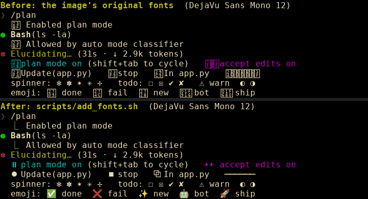
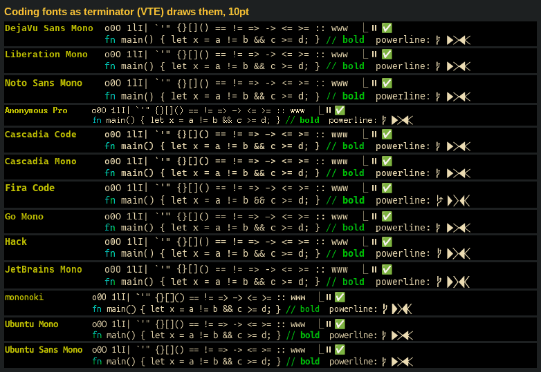
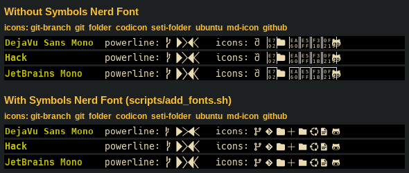
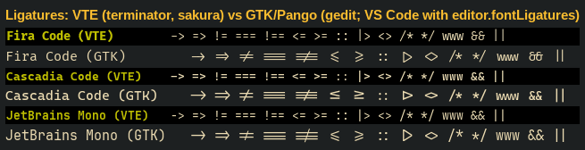

# Fonts

`scripts/add_fonts.sh` installs every font in this image that doesn't arrive as another package's dependency.
It runs from `Dockerfile`, so `brettdev` and `brettdev-full` both get it. It covers:
- fallback fonts, so symbols, emoji and other writing systems render;
- fonts compatible with Microsoft Office's (Arial, Times New Roman, Courier New, Calibri, Cambria) and a math
  font;
- a set of coding fonts;
- Nerd Font icons.

This document explains what each font is for, what it can and can't do, and why some obvious candidates were
left out. Everything here was checked on 2026-10-03 with the tools in [`tests/fonts/`](tests/fonts/README.md),
which can re-check it.



## Why the image needs an explicit font list

Every `apt-get install` here and in the base image uses `--no-install-recommends`. That keeps the image lean,
but fonts are almost always *recommended* rather than required, so they silently never arrive. Before
`add_fonts.sh`, `brettdev-full` had 21 font families (DejaVu, Liberation, URW base35, OpenSymbol, FontAwesome
4.7, GLYPHICONS) and nothing else.

How a character gets drawn: the application starts with its configured font (`DejaVu Sans Mono 8` in the
terminator that first showed the problem). For each character that font lacks, fontconfig supplies the next
font in its fallback order that has it. When *no* installed font has the character, GTK and VTE draw a hex box
with the codepoint inside: "tofu".

That is what happened to Claude Code's UI. The characters it draws that no font had:

| Glyph | Codepoint | Where Claude Code uses it | Now provided by |
|---|---|---|---|
| ⎿ | U+23BF | in front of every tool result | Noto Sans Symbols |
| ⏵ ⏸ | U+23F5, U+23F8 | "accept edits on", "plan mode on" | Noto Sans Symbols2 |
| ⏺ ⏹ | U+23FA, U+23F9 | tool bullets, stop | Noto Sans Symbols2 |
| ⎯ ⧉ | U+23AF, U+29C9 | dividers, IDE selection marker | Noto Sans Symbols, Noto Sans Math |
| ✅ ❌ ✨ 🤖 🚀 | | emoji in model output and PR footers | Noto Color Emoji |

The spinner characters (`✻ ✽ ✶`), `❯`, `●`, `☐ ☒`, `✔ ✘` and `⚠` were always fine, because DejaVu has them.

## What other packages recommend, and we skip

**LibreOffice** (the `libreoffice` metapackage) recommends 11 font packages:

| Package | Status | What it is |
|---|---|---|
| `fonts-noto-core` | installed by `add_fonts.sh` | symbols plus ~190 families for nearly every non-CJK script |
| `fonts-crosextra-carlito` | installed by `add_fonts.sh` | metric-compatible with Calibri |
| `fonts-crosextra-caladea` | installed by `add_fonts.sh` | metric-compatible with Cambria |
| `fonts-noto-mono` | present (dependency of `fonts-noto-core`) | Noto Sans Mono |
| `fonts-liberation` | installed by `add_fonts.sh` | metric-compatible with Arial, Times New Roman, Courier New; Liberation Mono is also terminator's default font |
| `fonts-liberation-sans-narrow` | brettdev-full only | Arial Narrow. `fonts-liberation` only *recommends* it; Chrome's installer pulls it in (`apt-get install -f`, recommends on). Without it, Arial Narrow falls back to URW's metric-compatible Nimbus Sans Narrow. |
| `fonts-noto-extra` | skipped | 334 MB of extra weights and widths for families core already has; no new scripts |
| `fonts-noto-ui-core` | skipped | Noto variants with tighter line spacing for UI text |
| `fonts-dejavu` | skipped | metapackage that adds `fonts-dejavu-extra` (condensed and light styles) |
| `fonts-linuxlibertine` | skipped | Linux Libertine/Biolinum; only for documents set in them |
| `fonts-sil-gentium-basic` | skipped | Gentium; likewise |

**The browsers recommend nothing**, and depend on the system for every glyph:
- **Chrome** (`google-chrome-stable`) Depends on `fonts-liberation`, has no Recommends or Suggests, and bundles
  no fonts.
- **Firefox** (the Mozilla PPA build) Depends on `libfontconfig1` and only *Suggests* `fonts-lyx`: old TeX
  fonts that its current MathML font list no longer uses. It bundles a single font, `TwemojiMozilla.ttf`. That
  is why Firefox showed emoji even when nothing else could.

**Where the other pre-existing fonts come from** (installed reverse dependencies):
- DejaVu ← `fontconfig-config`;
- Liberation ← `google-chrome-stable`, so it used to reach `brettdev-full` only; `add_fonts.sh` now installs
  it in both images;
- URW base35 ← Ghostscript (`libgs10-common`);
- OpenSymbol ← `libreoffice-core`;
- GLYPHICONS ← `libjs-bootstrap`;
- FontAwesome 4.7 ← only `ntopng-data`. It disappears now that ntopng is disabled (`4287131`), and nothing is
  lost: see [FontAwesome](#fontawesome-not-added).

Ghostscript's `libgs10-common` also *recommends* `fonts-droid-fallback`, which must stay out: see
[Gotchas](#side-effects-and-gotchas).

## What `add_fonts.sh` installs

### Glyph fallback

- **`fonts-noto-core`** (42.5 MB): Noto Sans and Noto Serif across ~190 families, covering nearly every non-CJK
  writing system. It also includes Noto Sans Symbols, Symbols2 and Math, which carry Claude Code's UI glyphs,
  and it pulls in `fonts-noto-mono`.
- **`fonts-noto-cjk`** (91 MB): Noto Sans and Serif CJK in Simplified Chinese, Traditional Chinese, Hong Kong,
  Japanese and Korean forms, Regular and Bold.
  - Chinese, Japanese and Korean were the last writing systems still showing as tofu, in the browsers,
    terminals and LibreOffice alike.
  - Its `70-fonts-noto-cjk.conf` picks the regional glyph forms for language-tagged text (`lang="ja"` and so
    on). Untagged Han text resolves to Noto Sans CJK JP.
- **`fonts-noto-color-emoji`** 2.047 (10.5 MB): colour emoji (CBDT bitmaps) for Unicode 16.0, per Ubuntu's
  changelog. Upstream has reached Unicode 18.

### Office and math

- **`fonts-liberation`**: metric-compatible with Arial, Times New Roman and Courier New. Fontconfig maps those
  names to Liberation Sans, Serif and Mono.
  - Liberation Mono is also terminator's default font here (`Liberation Mono 9`, from `personalization.tar`).
  - Before this package was added, only Chrome brought Liberation in, so plain `brettdev` silently drew that
    default in Nimbus Mono PS, a Courier clone (see [Gotchas](#side-effects-and-gotchas)).
- **`fonts-crosextra-carlito`** and **`fonts-crosextra-caladea`**: metric-compatible with Calibri and Cambria,
  Microsoft Office's defaults since 2007.
  - With them, `.docx` and `.pptx` files keep their line breaks and page count.
  - Fontconfig's `30-metric-aliases.conf` maps the names automatically (`Calibri` → Carlito, `Cambria` →
    Caladea), in LibreOffice and on web pages alike.
- **`fonts-stix`**: STIX Math, a font with the OpenType **MATH** table that MathML layout needs.
  - Firefox's MathML font list (Latin Modern Math, STIX Two Math, … STIX Math, …) matched nothing installed
    before, so MathML fell back to DejaVu Serif.
  - noble's Noto Sans Math has no MATH table, so it doesn't count.

### Coding fonts

Pick one as your terminal or editor font; see [Coding fonts compared](#coding-fonts-compared).

### Icons

Symbols Nerd Font is downloaded from GitHub, since it isn't packaged for noble; see
[Icons](#icons-symbols-nerd-font).

### Size

The packages total 171 MB as declared, plus 5 MB of Nerd Font. In a test build on the bare base,
`add_fonts.sh` adds one **188 MB** layer (`docker history`). Noto CJK is about half of that.

## Coding fonts compared



| Font (package) | Version: noble vs upstream | Weights | Italics | Ligatures¹ | Powerline² | Codepoints | Notes |
|---|---|---|---|---|---|---|---|
| **DejaVu Sans Mono** (already present) | 2.37 | Book, Bold | oblique only | – | – | 3,324 | fontconfig's `monospace` |
| **Liberation Mono** (`fonts-liberation`) | 2.1 | Regular, Bold | yes | – | – | 2,305 | Courier New metrics; the image's terminator default (`Liberation Mono 9`) |
| **Noto Sans Mono** (via `fonts-noto-core`) | 2.006 | Regular, Bold | – | – | – | 3,365 | |
| **Anonymous Pro** | 1.002 | Regular, Bold | yes | – | – | 621 | hand-tuned bitmaps at 10–13 px (≈7.5–10pt at 96 DPI); *Anonymous Pro Minus* is the same without them. Renders small. |
| **Cascadia Code** / **Cascadia Mono** | **2102.03** vs 2407.24 | variable, ExtraLight–Bold | **no**³ | Code 17/17, Mono none | `PL` variants only | 1,482 | Cascadia Mono is the no-ligature variant; full Braille; stylistic sets ss02, ss19, ss20 |
| **Fira Code** | 6.2 (current) | Light, Regular, Retina, Medium, SemiBold, Bold | **no** (none upstream) | 17/17 | yes | 1,585 | 10 stylistic sets, 32 character variants |
| **Go Mono** | 2.008 | Regular, Bold | yes | – | – | 661 | slab serif; the WGL4 character set only; no OpenType features |
| **Hack** | 3.003 (current; last release 2018) | Regular, Bold | yes | – | yes | 1,625 | built from DejaVu/Bitstream Vera, so it's closest to the current look |
| **JetBrains Mono** | 2.304 (current) | Thin–ExtraBold (8) | yes, all 8 | 16/17 (no `www`) | yes | 1,362 | 4 stylistic sets, 20 character variants |
| **mononoki** | 1.6 (current) | Regular, Bold | yes | – | yes | 921 | renders small |
| **Ubuntu Mono** (`fonts-ubuntu`) | 0.862 | variable, Regular–Bold | yes | – | – | 1,237 | narrow, renders small |
| **Ubuntu Sans Mono** (`fonts-ubuntu`) | 1.006 | variable, Thin–Bold | yes | – | – | 1,223 | newer design than Ubuntu Mono |

1. Code tokens (out of 17) that shaping changes, measured with `tests/fonts/ligatures.py`. They show only in
   GTK apps and VS Code, never in terminator (see [ligatures](#where-ligatures-work)). A font can carry a
   `calt` feature and still shape none: Cascadia Mono does.
2. Powerline glyphs in the font itself. It hardly matters now: Symbols Nerd Font supplies them through
   fallback, whatever the primary font.
3. noble's 2102.03 predates Cascadia's italics, which arrived upstream from 2105.24, and its built-in Nerd Font
   variants (2404.23). If you want either, take Cascadia from GitHub instead of apt.

Practical notes:
- Anonymous Pro, Ubuntu Mono and mononoki look about one point smaller than the others at the same size.
- Stylistic sets and character variants change individual letters (a slashed or dotted zero, the shape of `l`
  or `g`, …). They take effect only in applications that let you switch OpenType features on.

## Icons: Symbols Nerd Font



**What it is.** `add_fonts.sh` downloads Symbols Nerd Font v3.5.1 from the Nerd Fonts release.
- **Coverage:** 10,624 icons (devicons, octicons, codicons, Font Awesome, Material Design, …) plus the Powerline
  glyphs.
- **Two families:** *Symbols Nerd Font*, and *Symbols Nerd Font Mono*, which keeps every icon to one cell.
- **Where it goes:** the fonts into `/usr/local/share/fonts/nerd-fonts-symbols`; upstream's
  `10-nerd-font-symbols.conf` into `/etc/fonts/conf.d`.

**What the fontconfig snippet does.** It has 398 `<alias><prefer>Symbols Nerd Font</prefer></alias>` rules:
one for `monospace`, plus one for each of 397 named font families, mostly coding fonts.
- These are *weak* preferences, so the icon font only supplies codepoints the requested font lacks.
- `monospace` still resolves to DejaVu Sans Mono.

**Before** it, icon codepoints were mostly hex boxes. Some were worse than boxes:
- DejaVu Sans owns U+F418 (the octicon git-branch) and drew a `∂`-like glyph there;
- FontAwesome 4.7 drew its own, older versions of a few icons.

**Powerline.** VTE does *not* draw Powerline glyphs itself: with no font that has them, they render as hex
boxes. In this image they come from Hack, Fira Code, JetBrains Mono, mononoki, Cascadia's PL variants, or this
font.

**Using it:**
- lazygit: `gui: { nerdFontsVersion: "3" }` in `~/.config/lazygit/config.yml`;
- starship and oh-my-posh prompts;
- `eza --icons`;
- nvim file trees.

### FontAwesome: not added

- **It's stale.** noble's `fonts-font-awesome` is Font Awesome **4.7** from 2016, despite its
  `5.0.10+really4.7.0` version string. Upstream is at 7.3.1.
- **It's redundant.** All 694 of its icons (U+F000–U+F500) are in Symbols Nerd Font at the same codepoints
  (`tests/fonts/charset_diff.py`: 0 missing).
- **Nobody here needs it.**
  - 79 packages in noble and noble-updates depend on it or recommend it. Nearly all are web apps and
    documentation (mkdocs, jupyterhub, Sphinx themes, `rust-*-doc`, netdata-web, ntopng-data) that serve its
    web-font files rather than use it as a system font.
  - The desktop ones (cantata, keepassxc, lsd, bumblebee-status) aren't in this image.
  - Nothing here asks for the family by name.

## Where ligatures work



| Where | Ligatures |
|---|---|
| terminator, sakura and other VTE terminals | never (measured with VTE 0.76) |
| GTK/Pango text, e.g. gedit | yes, by default (measured with Pango) |
| VS Code | with `"editor.fontLigatures": true`, or a feature string such as `"'ss01', 'cv02'"` that also turns on stylistic sets and character variants |
| kitty | on by default (`disable_ligatures` turns them off), per kitty's documentation; not tested here |

## Choosing a font

**terminator:** Preferences → Profiles → General → Font, or in `~/.config/terminator/config`:

```
[profiles]
  [[default]]
    font = JetBrains Mono 9
    use_system_font = False
```

The image's default comes from `personalization.tar` (`Liberation Mono 9`).

**VS Code**, in `settings.json`:

```json
"editor.fontFamily": "'JetBrains Mono', 'Fira Code', monospace",
"editor.fontLigatures": true,
"terminal.integrated.fontFamily": "'JetBrains Mono'"
```

**kitty:** `font_family JetBrains Mono` in `~/.config/kitty/kitty.conf`.

**After installing fonts into a running container**, applications keep the font list they loaded at startup.
Terminator runs single-instance over D-Bus, so a new window from the menu joins the old process and still
can't see the new fonts. Start a separate one with `terminator -u`, or close every terminator window first.

## Side effects and gotchas

- **`sans-serif` now resolves to Noto Sans** instead of DejaVu Sans, because Ubuntu's `60-latin.conf` lists
  Noto Sans first. GTK interfaces and Firefox's default sans-serif font look slightly different as a result.
  `monospace` is unchanged: DejaVu Sans Mono is first in that list.
- **A missing font fails silently.** When a configured font isn't installed, fontconfig substitutes a
  metric-compatible alias without any warning.
  - Example: until `fonts-liberation` was added to `add_fonts.sh`, only Chrome brought it in, in
    `brettdev-full`. Plain `brettdev` drew terminator's default `Liberation Mono 9` in **Nimbus Mono PS**, URW's
    Courier clone.
  - `fc-match "Font Name"` shows what a name really resolves to, and `check_fonts.sh` asserts the important
    ones.
- **`fonts-droid-fallback` must stay out.**
  - Its `65-droid-sans-fallback.conf` makes Droid Sans Fallback a preferred `sans-serif` font.
  - Measured in a test image with it installed: Japanese-tagged text switched from Noto Sans CJK JP to Droid
    Sans Fallback, which has one weight and Chinese glyph forms. Untagged, Korean and Chinese text stayed on
    Noto.
  - Ghostscript's `libgs10-common` recommends it, and 59 of ubuntu-desktop's on-demand install scripts run apt
    *with* recommends.
  - `tests/fonts/check_fonts.sh` fails if it ever appears.
- **Ubuntu rejects bitmap-only fonts** (`70-no-bitmaps-except-emoji.conf`). `fonts-terminus-otb`, for example,
  renders with broken letter spacing.
- **Never run `scripts/add_fonts.sh` in a running container.** It ends with `rm -rf … /tmp/*`, which is meant
  for `docker build` and would delete the desktop's D-Bus socket. Use `apt-get install` directly, or
  `tests/fonts/docker_build_test.sh`.

## Not installed, and why

| Package | Why not |
|---|---|
| `fonts-noto` (metapackage) | It Depends only on `fonts-noto-core`, which is already installed. Everything else in it is a Recommend, which `--no-install-recommends` skips; installed anyway, that's ~770 MB with core (CJK extra weights 214 MB, Noto extra 334 MB, UI extra 72 MB, …). |
| `fonts-noto-extra`, `fonts-noto-cjk-extra` | extra weights and widths of families already installed; no new scripts |
| `fonts-droid-fallback` | takes Japanese away from Noto CJK (see above) |
| `fonts-font-awesome` | covered by Symbols Nerd Font (see above) |
| `fonts-symbola`, `fonts-unifont`, `fonts-freefont-ttf` | Symbola or Unifont alone would also have fixed Claude Code's glyphs; FreeFont misses 🤖 and 🚀. Noto does it better: Symbola's emoji are thin monochrome outlines, and Unifont is bitmap-style. |
| `fonts-terminus-otb` | bitmap font, rejected by Ubuntu's fontconfig rules |
| `fonts-inconsolata` | noble ships version 001.010 from around 2009; upstream is 3.000 |
| `fonts-powerline` | the glyphs are already in Hack, Fira Code, JetBrains Mono, mononoki and Symbols Nerd Font |
| `fonts-lyx` | Firefox's only font suggestion; its MathML list no longer uses these TeX fonts |
| `fonts-texgyre-math` | five more MathML fonts (6.5 MB); STIX Math is enough |
| `fonts-ubuntu-classic` | `fonts-ubuntu` already contains Ubuntu Mono |
| Iosevka, Monaspace, IBM Plex Mono, Source Code Pro, Victor Mono, Commit Mono, Intel One Mono, Maple Mono, Geist Mono, current Cascadia | not packaged for noble; each would need a pinned GitHub download like the Nerd Font one in `add_fonts.sh` |

## Checking

```bash
tests/fonts/check_fonts.sh                    # PASS/FAIL for everything in this document
fc-list ':charset=23bf' family                # ⎿           -> Noto Sans Symbols
fc-match 'sans-serif:charset=4e2d' family     # 中          -> Noto Sans CJK JP
fc-match Calibri family                       #             -> Carlito
fc-match 'Liberation Mono' family             #             -> Liberation Mono (terminator's default)
fc-match monospace family                     #             -> DejaVu Sans Mono
tests/fonts/glyphtest.sh                      # eyeball it in the current terminal
```

[`tests/fonts/README.md`](tests/fonts/README.md) lists the rest of the tools and how each finding above was
reached.

## History

- `669699d` added `fonts-noto-core` and `fonts-noto-color-emoji` to `scripts/add_dev_tools.sh`, after Claude
  Code's UI glyphs showed up as hex boxes in terminator.
- `6685724` added the coding fonts and `scripts/add_nerd_fonts.sh` (Symbols Nerd Font, run from
  `Dockerfile.full`).
- Then every font moved into `scripts/add_fonts.sh`, run from `Dockerfile`. Noto CJK, Liberation,
  Carlito/Caladea and STIX were added, along with this document and `tests/fonts/`.
